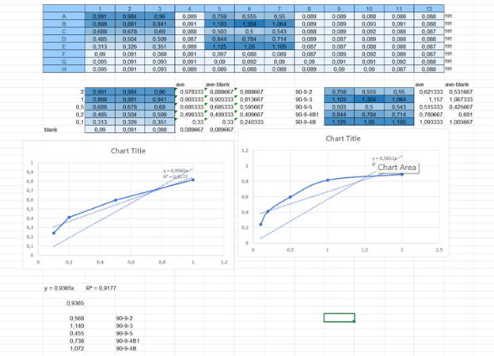

### Bradford protein assay
#### *Protocol*  
### (A-B) 
 1.	Take a 96-well plate
2.	Take out the standards, place on ice until completely thawed
3.	Take the standards in the solution in which the assay is performed. In this case *RIPA*.
4.	Brad solution should be diluted 1:5. So take 1 part Brad and 4 parts *DDW*. Add 200 µl to each well. Total 18 wells of standards.
5.	Then in each well add 4 µl of *BSA* and also 4 µl of test protein.
6.	Add along the wall, burst the bubbles with a needle.
7.	Place on a rocker for 5 minutes
8.	Check for homogeneity
9.	If there is any precipitate - stir with a pipette.
10.	Then place it in the machine.
11.	On the computer select protocol - procedure - absorbance 595. Save in excel format

### (C)

### (D)

| Date     | Species           | Location        | Sex  | Length | Person  | Count |
|----------|-------------------|-----------------|------|--------|---------|-------|
| 01.2024  | Moon Jellyfish    | Tel Aviv        | F    | 30 cm  | Valeriia  | 5     |
| 02.2024  | Lion's Mane Jellyfish | Haifa       | M    | 25 cm  | Valeriia | 7     |
| 03.2024  | Blue Blubber Jellyfish | Eilat      | F    | 35 cm  | Valeriia   | 6     |
| 04.2024  | Box Jellyfish     | Ashdod          | M    | 40 cm  | Valeriia  | 8     |
| 05.2024  | Compass Jellyfish | Netanya         | F    | 32 cm  | Valeriia  | 9     |

### (E)
[Article about The Dynamically Evolving Nematocyst Content of an Anthozoan, a Scyphozoan, and a Hydrozoan](https://academic.oup.com/mbe/article/32/3/740/979655?view=extract&login=false)

### (F)
[The protocol of RNA-seq](https://www.ncbi.nlm.nih.gov/pmc/articles/PMC6096346/#:~:text=The%20protocol%20of%20RNA%2Dseq,using%20a%20high%2Dthroughput%20platform.)