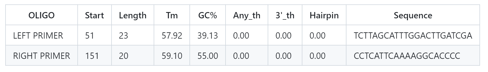
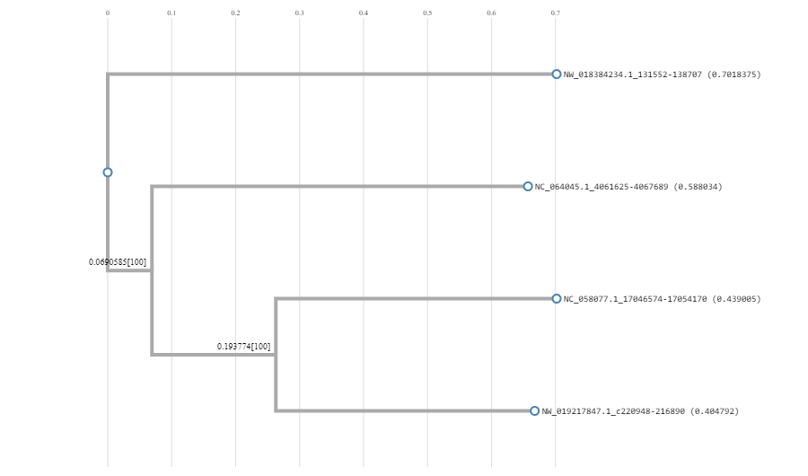

### Steps for Primer Design for "LOC5516945 Forkhead Box J1" in Nematostella vectensis

1. **Search for the Gene Sequence:**
   - Go to the NCBI website.
   - Search for "LOC5516945 Nematostella vectensis."
   - Select the appropriate gene entry.

2. **Obtain FASTA Sequences:**
   - Select the orthologues of the gene among various Cnidaria members.
   - Find the FASTA sequence section and select the "FASTA" format for each sequence.

3. **Multiple Sequence Alignment:**
   - Input the sequences into the CLUSTALW tool.
   - Run the alignment process.

4. **Review the Alignment Results:**
   - Identify conserved regions from the alignment results for primer design.
   
5. **Select Conserved Region for Primers:**
   - Choose a conserved region from the alignment:
     ```
     CTTTTTTGTTTTGATCTATTTATAAAATTGTCTCTTTAGGACACTACTCA
     CTCTTAGCATTTGGACTT-------GATCGACCGATCGCAAAAGATCTAA
     CTTTTTGTATTCTAATCAT-----ATTTTGAATGTTTATTTAACGGGGTG
     CCTTTTGAATGAGGTCGG------AAATTGTCCATTCAATATTATTCAAA
     ```

### Primer Selection Criteria:
- **Primer Length:** 18-25 nucleotides
- **Melting Temperature (Tm):** 55-65°C
- **GC Content:** 40-60%
- **Conservation:** Identical or nearly identical for all sequences

Using Primer3 tool, we selected primers from the most conserved region:

 


_Fig.1 - Results from the primer3._

### Phylogenetic Analysis

After designing the primers, proceeded with creating a phylogenetic tree using the alignment data.


This phylogenetic tree illustrates the evolutionary relationships among the orthologous genes of Cnidaria species, specifically highlighting the genetic divergence and similarities of the "LOC5516945 forkhead box J1" gene in Nematostella vectensis and its counterparts in other Cnidarian species.
