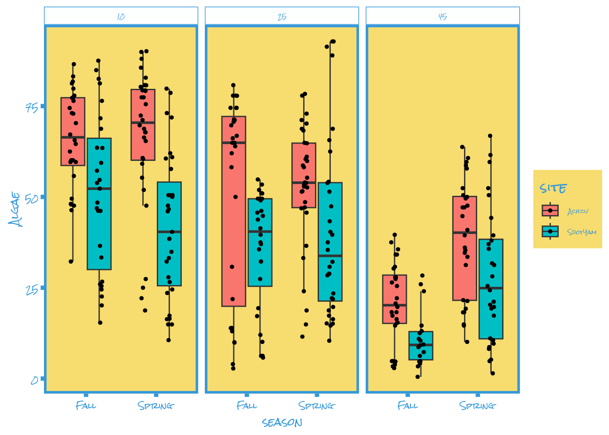
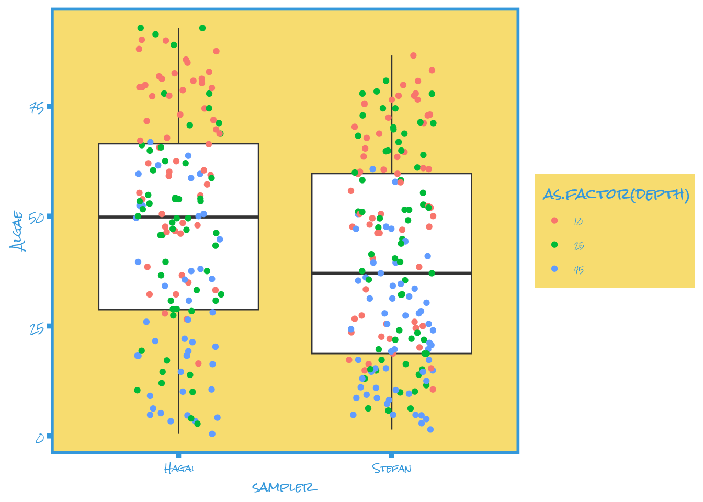

# Data analysis and visualization

1. We study the data on the coverage of various taxonomic groups to understand how they are influenced by location, depth, and season. We use statistical methods and graphs to identify patterns and differences.

2. Load necessary libraries for data analysis and visualization (`ggplot2`, `dplyr`, `tidyr`, etc.).

```
library(ggplot2)
library(dplyr)
library(tidyr)
library(broom)
library(grid)
library(cowplot)
library(corrplot)
library(Hmisc)
library(ARTool)

# install.packages("remotes")
# remotes::install_github("MatthewBJane/ThemePark")
library(ThemePark)
```

3. Load metadata and coverage data from CSV files using `read.csv`.

```
# Load data
photo_metadata=read.csv("~/Documents/GitHub/Research-Methods-Valeriia/Photosurvey_metadata (1).csv", header=TRUE, row.names=1, stringsAsFactors = TRUE)

# load the processed and filtered coverage data by taxonomic group
photosurvey_coverage=read.csv("~/Documents/GitHub/Research-Methods-Valeriia/Photosurvey_processed_data (1).csv", header=TRUE, row.names=1, stringsAsFactors = TRUE)

#make sure the order of trnasect_IDs is the same in the data and the metadata
ord=match(row.names(photosurvey_coverage), row.names(photo_metadata))
photo_metadata=photo_metadata[ord,]

#merge metadata and coverage values
Photosurvey=cbind(photo_metadata, photosurvey_coverage)
```

4. Create a plot of algae (Algae) coverage by sites (site) with color coding for depth (depth) using `ggplot2`.

```
# let's look at the total coverage in relation to site
ggplot(Photosurvey, aes(x=site, y=Algae))+
  geom_boxplot(outlier.shape = NA)+
  geom_point(aes(color=as.factor(depth)),position=position_jitter(width=0.2))+ 
  theme_simpsons()
```

**Output:**


5. Perform Bartlett's test to check for homogeneity of variance.

```
#1. test homogeneity of variance
bartlett.test(Photosurvey$Algae~Photosurvey$site)
```

**Output:**

```
## 
##  Bartlett test of homogeneity of variances
## 
## data:  Photosurvey$Algae by Photosurvey$site
## Bartlett's K-squared = 0.79934, df = 1, p-value = 0.3713
```

6. Use Kruskal-Wallis test to check for significant differences in algae coverage levels across sites.

```
#2 test difference in coverage levels
kruskal.test(Algae~site, data=Photosurvey)
```

**Output:**

```
## 
##  Kruskal-Wallis rank sum test
## 
## data:  Algae by site
## Kruskal-Wallis chi-squared = 26.676, df = 1, p-value = 2.406e-07
```

7. Create a plot of algae coverage by seasons (season) considering sites (site) and depth using `facet_grid`.

```
ggplot(Photosurvey, aes(x=season, y=Algae, fill=site))+
  geom_boxplot(outlier.shape = NA)+
  geom_point(position=position_jitterdodge(jitter.width = 0.2), size=1)+
  theme_simpsons() +
  facet_grid(.~depth)
```

**Output:**



8. Perform a multi-factor ANOVA (ANOVA) to assess the influence of site, depth, and season factors.

```
### now let's test for all factors together- non-parametric anova
m=art(Algae~site+as.factor(depth)+season+site*as.factor(depth)*season, data=Photosurvey)
anova(m)
```

**Output:**

```
## Analysis of Variance of Aligned Rank Transformed Data
## 
## Table Type: Anova Table (Type III tests) 
## Model: No Repeated Measures (lm)
## Response: art(Algae)
## 
##                                Df Df.res F value     Pr(>F)    
## 1 site                          1    328 47.8826 2.3838e-11 ***
## 2 as.factor(depth)              2    328 74.0189 < 2.22e-16 ***
## 3 season                        1    328  3.0259 0.08288042   .
## 4 site:as.factor(depth)         2    328  2.8709 0.05807000   .
## 5 site:season                   1    328  2.3674 0.12485573    
## 6 as.factor(depth):season       2    328  9.2187 0.00012731 ***
## 7 site:as.factor(depth):season  2    328  1.3538 0.25970632    
## ---
## Signif. codes:   0 '***' 0.001 '**' 0.01 '*' 0.05 '.' 0.1 ' ' 1
```

9. Create a plot of algae coverage by samplers (sampler) and perform Bartlett's and Kruskal-Wallis tests to check for differences.

```
### let's examine the sampler....

ggplot(Photosurvey, aes(x=sampler, y=Algae))+
  geom_boxplot(outlier.shape = NA)+
  geom_point(aes(color=as.factor(depth)),position=position_jitter(width=0.2))+
  theme_simpsons()
```

**Output:**



```
#1. test homogeneity of variance

bartlett.test(Photosurvey$Algae~Photosurvey$sampler)
```

**Output:**

```
## 
##  Bartlett test of homogeneity of variances
## 
## data:  Photosurvey$Algae by Photosurvey$sampler
## Bartlett's K-squared = 0.68449, df = 1, p-value = 0.408
```

```
#2) test difference in coverage levels

kruskal.test(Algae~sampler, data=Photosurvey)
```

**Output:**

```
## 
##  Kruskal-Wallis rank sum test
## 
## data:  Algae by sampler
## Kruskal-Wallis chi-squared = 10.049, df = 1, p-value = 0.001524
```

10. Create a correlation plot between algae (Algae) and bryozoans (Bryozoa) with a linear regression line.

```
corrs=rcorr(as.matrix(Photosurvey[,10:22]), type="spearman")

#we need a function that will take the square matrix and turn it to long format.

flattenCorrMatrix <- function(cormat, pmat) {
  ut <- upper.tri(cormat)
  data.frame(
    row = rownames(cormat)[row(cormat)[ut]],
    column = rownames(cormat)[col(cormat)[ut]],
    cor  =(cormat)[ut],
    p = pmat[ut]
  )
}

#now we apply this function to our data
corrs_flat=flattenCorrMatrix(corrs$r, corrs$P)

#add p value adjustment using the Benjamini-Hochber method (BH)
corrs_flat$p.adj=p.adjust(corrs_flat$p, "BH")

# now plot your correlation of interest e.g., my taxon of interest and live coverage

ggplot(Photosurvey, aes(x=Algae, y=Bryozoa))+
  geom_point()+
  geom_smooth(method='lm')+
  theme_simpsons()
```

**Output:**


11. This analysis helps understand the impact of various factors on the coverage of algae and other groups, and identify significant correlations between them. Visualization and statistical tests provide better insights into the data and reveal important trends.


